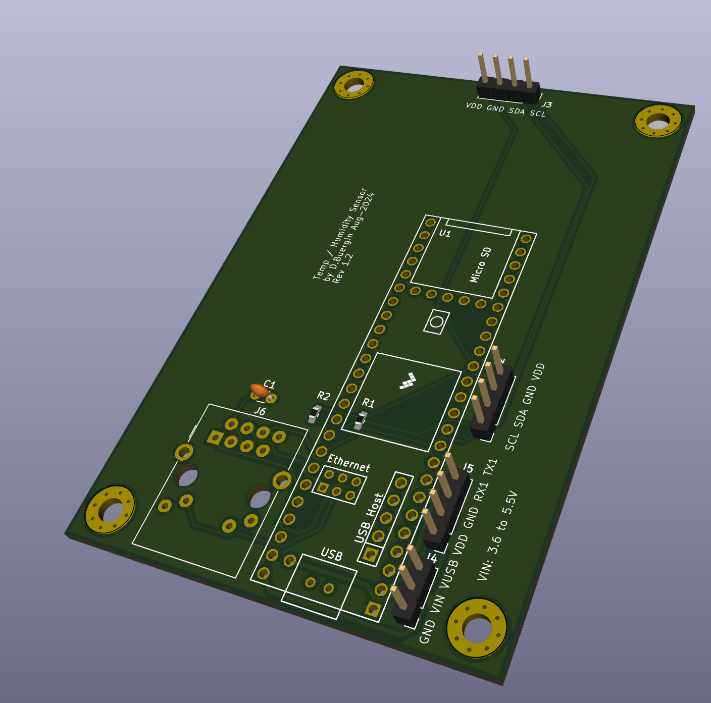

# Teensy-4.1-Custom-Board

Custom Board for a Teensy 4.1 with Ethernet, 2 x I2C ports and a port with RX1/TX1 

Simple baseboard for a Teensy 4.1 and the Ethernet kit available also from https://prjc.com

##Some remarks:
- It's my first KiCad board, so a lot of things will be wrong (i assume...)
- Since i use https://aisler.com to produce the PCB and Aisler allows to simply upload the _pcb file from KiCad, all the Gerber stuff is untested. So don't simply upload the gerber files. Setup KiCad 8 and create your own gerber files
- KiCad 8.0.5 was used
- I do not sell any PCB's

##Ideas for the future:
- Make more pins available (SPI foremost)
- Center the top I2C header so that the Adafruit 4-Segment Display is more in the middle of the board
- Maybe add an FRAM (SPI based)